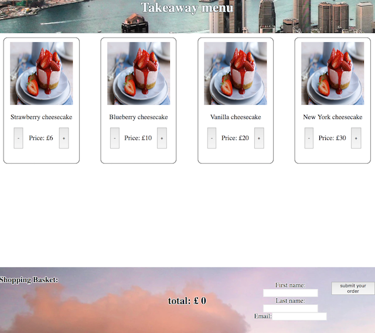

# Deliver-Eat app

- app to place order and browse items from database.

<p align="center"></p>

## Technology used

- React
- node.js
- Javascipt
- CSS with responsive design
- HTML

# features

- you can browse items(data pulled from server) add quantity to the shopping basket
- shopping basket will display current total
- you can submit order with customer information
- orders can be viewed <a href="delivereat.herokuapp.com/orders">here</a>

#team

Ethan - ([Twitter](https://twitter.com/Ethanng329)) - ([Github](https://github.com/ethan329))

# to run app

```
$npm run build
```
