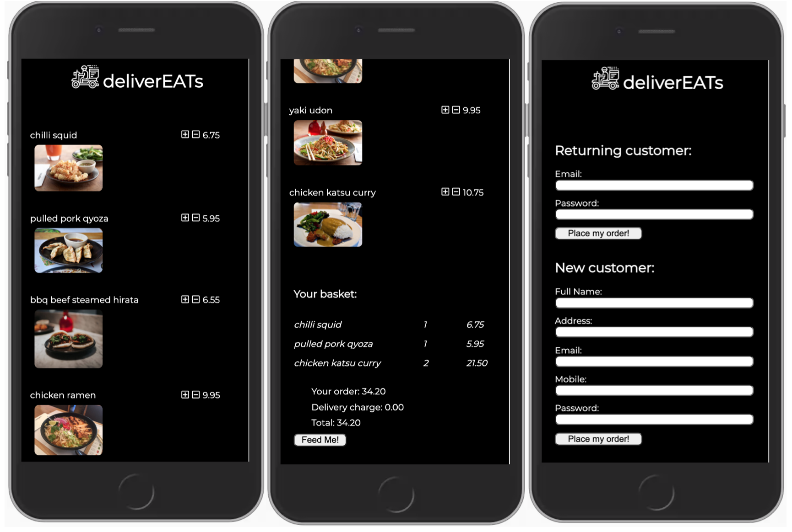

# DeliverEATs
---

---
## Order your food online with DeliverEATs!
This is a simple app based on my favourite dishes from Wagamama. Customers are able to add and remove items from the basket and place their order either by loggin in or as a new customer. When the order is placed, the customer receives a text message confirming it whilst the app displays a modal with the order number.


## Installation and set up

- Clone the project and run `npm install`
- Create your own local PostreSQL database instance and create the tables by running `pgweb` navigating to localhost:8081 and running the query in the `database.sql` file.
- Create a `.env` file with the following variables

```
DB_HOST=localhost
DB_NAME=
DB_USERNAME=
DB_PASSWORD=

```

- Run `npm start` to launch the app and navigate to localhost:8080
- Use `npm run dev -- --watch` to build React
- Navigate to `localhost:8080` in your browser to view

---

### Tech stack

- React
- PostgreSQL
- Node.js
- Express
- Handlebars
- SCSS
- Classnames
- Git
- Twilio

### Build tools

- Webpack
- Babel


### Functionality and features

- Menu items can be added, removed from the basket and increase/decreased in quantity
- Added menu items can be viewed in the basket menu with a breakdown of costs
- An order can be placed with order ID output and text message confirmation
- Return customers are able to log in 

